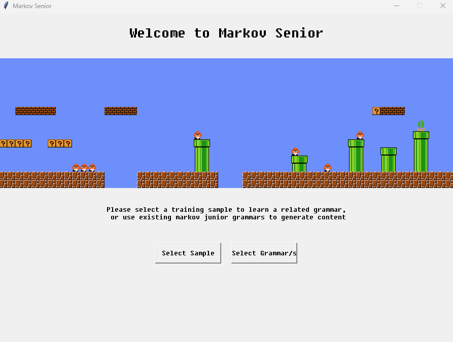
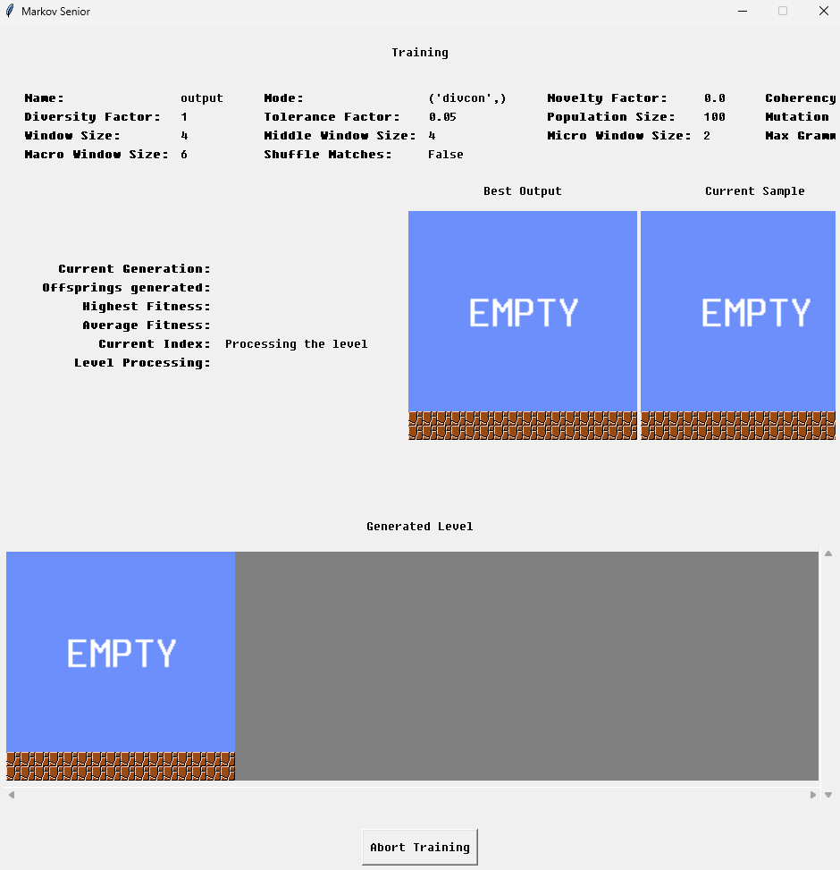

# Markov Senior - Learning Markov Junior Grammars to Generate User-specified Content

If you are using this code in your own project, please cite our paper:

```
@inproceedings { OguzDoc2024,
  author = {Mehmet Kayra Oguz and Alexander Dockhorn},
  title = {Markov Senior - Learning Markov Junior Grammars to Generate User-specified Content},
  booktitle = {2024 IEEE Conference on Games (CoG)},
  year = {2024},
  pages = {1-8},
  note = {to be published}
}
```


# Setup

This section includes the necessary steps to get Markov Senior running on your system. Please be aware that the program has been developed on a Linux-based system and is optimized as such. The experience may be different on other distributions. Please raise a ticket via Github issues in case you face any problems.


## PIP

You will need Python 3 and the packages specified in requirements.txt.

We recommend setting up a virtual environment with pip and installing the packages there.

```
$ pip3 install -r requirements.txt
```

Make sure you use the pip3 that belongs to your previously defined virtual environment.


# GUI

Running *Main.py* will start the GUI:



The button on the left allows to load a level. Following the screen instructions you can set parameters to steer the learning process. Default parameters are set to learn a grammar able to replicate the level as accurate as possible.



Results will be stored in the projects output folder. Going back to the main page or restarting the GUI allows you to run learned grammars and see their results.


# Authors

- [Kayra Oguz](https://www.linkedin.com/in/m-kayra-o%C4%9Fuz-a04488203/)** 
- [Alexander Dockhorn](http://www.tnt.uni-hannover.de/de/staff/dockhorn/)** 

The work itself derives from the bachelor's thesis by Mehmet Kayra Oguz, which was supervised by Alexander Dockhorn. The initial version of this repository is result of the related thesis.

# Copyright

This program is not endorsed by Nintendo and is only intended for research purposes. Mario is a Nintendo character which the authors don’t own any rights to. Nintendo is also the sole owner of all the graphical assets in the game.
